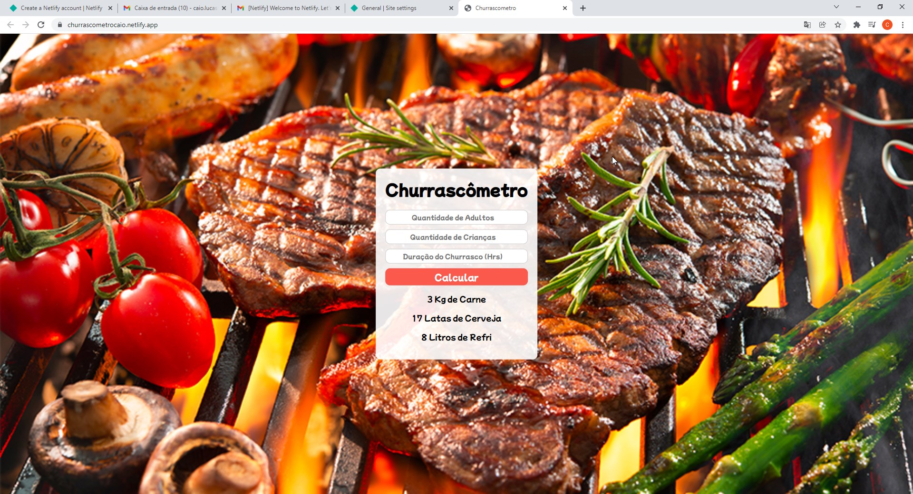

# Repositorio de estudo do curso ProgramadorBr 
 
 
<h2>Churrascômetro</h2>
    

        Primerio projeto JS feito no curso ProgBr.
    

    

        
    

     
    <a href="https://churrascometrocaio.netlify.app/" target="_blank">
       Clique para acessar o site!
    </a>
 
 
 
 

 
